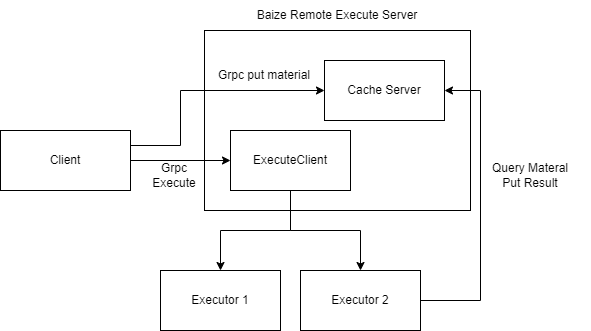

# BAIZE
<p align="center">
    <a href="https://github.com/dashjay/baize" target="_blank">
        
    </a>
</p>

> 白泽，中国古代神话中的瑞兽。能言语，通万物之情，知鬼神之事，“王者有德”才出现，能辟除人间一切邪气

> 为什么使用这个名字？
> 因为它的发音特别像 Google 开源的 [bazel](https://bazel.build/)  然后这个项目时和bazel相关的

## 关于

这个项目是 [bazel remote execution](https://github.com/bazelbuild/remote-apis) 的最小实现，可以用来学习了解 bazel 的远程执行时如何工作的。我也期望这个项目能够逐步完善，并且可以在生产环境中被使用

## 设计


简单来说，Bazel Remote Executor 暴露两个服务给客户端。
1. 缓存服务接收所有的资料，包含用户的源代码文件等，用户任务信息，任务执行结果等。
2. 执行服务帮助用户使用 Executor 执行任务。

缓存服务有不止一个后端。对于稍微小一些的对象，我们使用内存作为容器；对于中等的对象，我们使用 seaweedfs 作为后端；对于稍大的内容，我们使用 OSS 作为后端。

执行服务从客户端到执行器为用户执行任务。

## 开发

修改 `cmd` 和 `pkg` 中的代码, 运行如下脚本

```bash
./deploy/docker-compose/up.sh
```